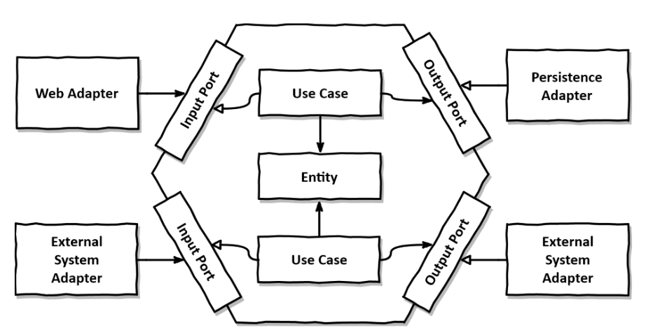

# TP MIAGE conception logicielle

NOTE: TP de deux slots de 1h20

## Nom du(des) étudiant(e)(s) de ce monôme/binôme 
WARNING: NE PAS OUBLIER DE MENTIONNER LES DEUX NOMS SI VOUS ETES EN BINOME!

#Raphael GUILLERMARD# et #Axel SOULARD# et #Elysee NONNONHOU#

Commentaires éventuels des étudiants : #XXXXXX#

## Pré-requis 

* Disposer d'un PC d'au moins 6 Gio de RAM avec 20 Gio de disque disponible ;
* Disposer d'une version recente de VirtualBox ;
* Disposer d'un compte Github par personne (ou un pour deux personnes si vous êtes en binôme) ;
* Télécharger et décompresser l'image VirtualBox de l'environnement de développement https://public.florat.net/cours_miage/vm-tp-miage.zip[ici] (à faire *avant le TP*). Le login/mot de passe est : `tp`/`tp`.

## Déroulement du TP

*Répondre aux questions de la feuille de TP juste sous la question* (en modifiant, commitant puis poussant le fichier `README.adoc`).

Nous fournissons différents projets Eclipse servant de base de travail aux exercices suivant. Cela permet un point de synchronisation de tous les étudiants à différents moments du TP. 

TIP: Fermer chaque projet Eclipse (sans supprimer les sources) avant de passer à l'exercice suivant pour éviter de confondre les projets ex1 et ex2.


### Exercice 1 - Etudier une API REST sans couches
_Temps estimé : 40 mins_

* Importer dans Eclipse les projets `todolist-debut-ex1` et `todolist-debut-ex2`.

Faire `File` -> `Import` -> `Projects from Git (with smart import)` -> `Clone URI` -> URI: `https://github.com/<x>/tp1-miage-2021.git` (conserver les autres options inchangées) -> 'Import projects from File System or Archives' : ne laisser cocher que `tp1-miage-2021/tolist-debut-ex1` et `tp1-miage-2021/tolist-debut-ex2` ('import as Maven') -> Bouton 'Finish'.

TIP: [Rappel Git] Trois dépôts sont ici utilisés: le dépot Github de l'enseignant (`bflorat/tp1-miage-2021`), le dépot Github du binôme (`<x>/tp1-miage-2021`), le dépot local sur le portable de l'un ou des deux étudiants du binôme.


* Observer le code du projet `todolist-debut-ex1`

*Le code est-il structuré en couches ? Quel problèmes ce code peut-il poser ?*

#On remarque que le code n'est pas structuré en couche. Le problème s'avère s'il y a beaucoup de classe, il va être difficile de s'y retrouver. L'un des objectif de la structuration des couches c'est pouvoir s'y retrouver et grouper les classes par paquet.#

*Où se trouve le code métier (voir la règle de gestion RG 1) ?*

#Le code métier dans todolist-debut-ex1 se trouve dans le contrôleur (TodoListController.java). Néanmoins, d'après la règle RG 1, il n'est pas bon de le mettre, ici.#

*Cette règle est-elle facilement testable par un test unitaire ?*

#Cette règle de gestion n'est pas facilement testable par un test unitaire parce qu'elle a une dépendance vers la base de donnée et plus particulièrement vers un objet JPA. Ainsi, afin de réaliser un test unitaire dessus, il faudrait un objet JPA ou un outil de mock.#

* Lancer une base PostgreSQL en Docker dans un terminal (on lance ici la base en mode interactif pour visualiser son activité. Pour la lancer en tâche de fond, remplacer les options `it` par `d` comme 'daemon'):
```bash
docker run -it -e POSTGRES_PASSWORD=password -p 5432:5432 postgres

*Expliquer cette ligne de commande (y compris les options utilisées)*

#-> la commande permetr de lancer une base PostgreSQL#
#run permet de lancer docker#
#L'option -it permet de connecter un terminal de l'utilisateur au flux d'entrée et de sortie#
#L'option -e met en place une variable d'environnement#
#POSTGRES_PASSWORD=password dit que password est la valeur du paramètre mot de passe#
#L'option -p permet de publier le port du conteneur à l'hôte#
#5432:5432 donne le numéro de port public et privé du conteneur#
#postgres c'est le nom de l'application pour le conteneur#

* Compléter le code manquant dans la méthode `TodoListController.createTodoItem()`

*Pourquoi `todoItemRepository` est-il `null` ? Quelle est la meilleure façon de l'injecter ?*

#todoItemRepository est null car il n'a pas été injecté de la bonne façon. Son instanciation ne se passe pas bien donc cela conduit à cette situation de null.#

#Au lieu de creer directement l'objet dans le contrôlleur, qui n'est pas une bonne pratique de conception, il est préfeérable de se faire injecter l'objet par l'injection de dépendance. On utilise @Inject. On pourra donc faire de l'autowiring.#

* Modifier le code en conséquence.

* Tester vos endpoints avec un client REST.

#Le lancement marche, aucune erreur n'est rendu : Started TodoListApplication in 5.182 seconds (JVM running for 6.04).#

[NOTE]
====
* Les URL des endpoints sont renseignées dans le contrôleur via les annotation `@...Mapping` 
* Exemple de body JSON : 

```json
{
    "id": "0f8-06eb17ba8d34",
    "time": "2020-02-27T10:31:43Z",
    "content": "Faire les courses"
  }
```
====

NOTE: Pour lancer l'application Spring, selectionner la classe `TodolistApplication` et faire bouton droit -> 'Run as' -> 'Java Application'.

* Quand les deux endpoints fonctionnent, commiter, faire un push vers Github et fermer le projet Eclipse (ne pas le supprimer).

* Vérifier avec DBeaver que les donnnées sont bien en base PostgreSQL.

### Exercice 2 - Refactoring en architecture hexagonale
_Temps estimé : 1 h 20_

* Partir du projet `todolist-debut-ex2`

NOTE: Le projet a été réusiné suivant les principes de l'architecture hexagonale : 


Source : http://leanpub.com/get-your-hands-dirty-on-clean-architecture[Tom Hombergs]

* Nous avons découpé le coeur en deux couches : 
  - la couche `application` qui contient tous les contrats : ports (interfaces) et les implémentations des ports d'entrée (ou "use case") et qui servent à orchestrer les entités.
  - la couche `domain` qui contient les entités (au sens DDD, pas au sens JPA). En général des classes complexes (méthodes riches, relations entre les entités)

*Rappeler en quelques lignes les grands principes de l'architecture hexagonale.*

#Les grands principes de l'architecture hexagonale sont :#
#- Une couche centrale qui est indépendante de toutes technologies (Domain Layer)#
#- Séparer explicitement les couches Applications, Domain et Infrastructure#
#- Les dépendances vont vers les domaines#
#- On isole les frontières par des Ports et des Adapters.#

Compléter ce code avec une fonctionnalité de création de `TodoItem`  persisté en base et appelé depuis un endpoint REST `POST /todos` qui :

* prend un `TodoItem` au format JSON dans le body (voir exemple de contenu plus haut);
* renvoie un code `201` en cas de succès. 

La fonctionnalité à implémenter est contractualisée par le port d'entrée `AddTodoItem`.

### Exercice 3 - Ecriture de tests
_Temps estimé : 20 mins_

* Rester sur le même code que l'exercice 2

* Implémenter (en junit) des TU sur la règle de gestion qui consiste à afficher `[LATE!]` dans la description d'un item en retard de plus de 24h.

*Quels types de tests devra-t-on écrire pour les adapteurs ?* 

#Les tests d'intégration (TI) sont les plus adaptés aux Adapters. Ils permettent d'évaluer la conformité d'un système ou d'un composant suivant des exigences fonctionnelles. On les effectue après les tests unitaire (TU) et avant les tests de validation.#

*Que teste-on dans ce cas ?*

#Nous allons directement tester le système pour voir sa réactivité#

*S'il vous reste du temps, écrire quelques uns de ces types de test.*

[TIP]
=====
- Pour tester l'adapter REST, utiliser l'annotation `@WebMvcTest(controllers = TodoListController.class)`
- Voir cette https://spring.io/guides/gs/testing-web/[documentation]
=====
